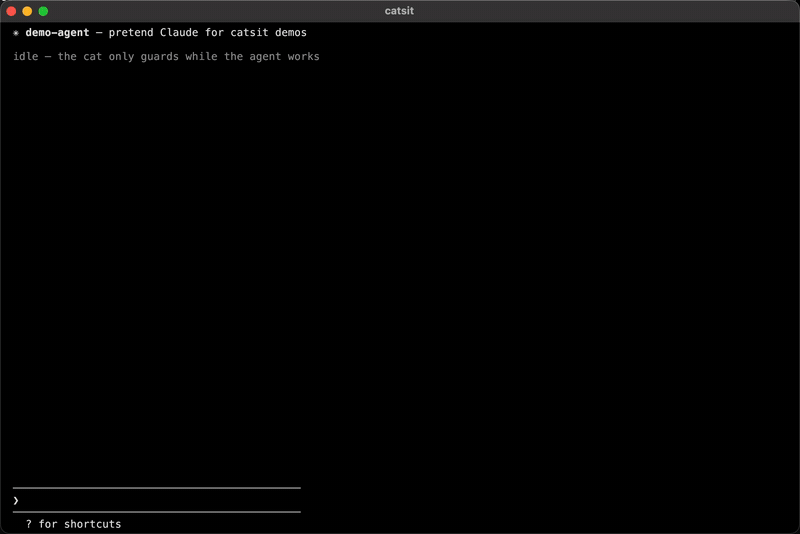
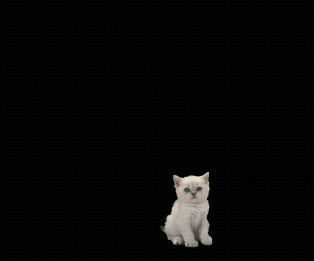
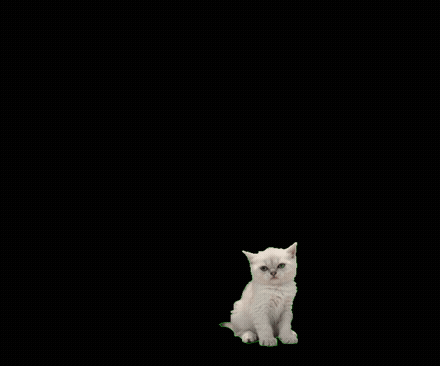
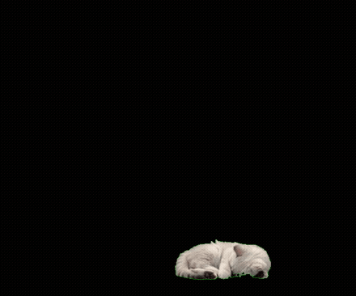
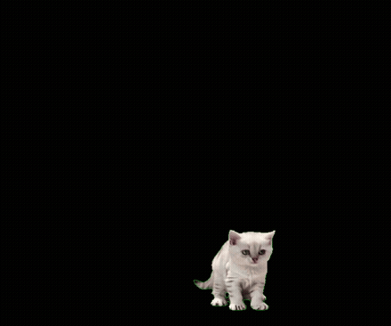

<div align="center">

# catsit

**A cat that babysits your AI agent, so you don't have to.**

While Claude works, a cat sits on your terminal and swallows your typing.<br>
The moment you're needed — permission prompt, question, done — the cat gets up, meows, and steps aside.



<sub>Real footage — one continuous take, not a sprite sheet. By default catsit never touches your input; <code>--guard</code> is opt-in.</sub>

[한국어](README.ko.md) · [日本語](README.ja.md) · [简体中文](README.zh-CN.md)

</div>

## The cat's day

One continuous performance, one kitten — every transition connects.

<table>
<tr>
<td align="center" width="33%"><b>agent starts working</b><br><sub>walks in, settles down</sub><br></td>
<td align="center" width="33%"><b>still working</b><br><sub>sits and waits — if the cat is calm, you're not needed</sub><br></td>
<td align="center" width="33%"><b>60s without your input</b><br><sub>curls up for a nap</sub><br></td>
</tr>
<tr>
<td align="center"><b>you touch a key</b><br><sub>wakes up the slow way: yawn, stretch, sit</sub><br></td>
<td align="center"><b>you're needed</b><br><sub>rears up with a meow (+ terminal bell)</sub><br></td>
<td align="center"><b>steps aside</b><br><sub>walks off — an empty screen means it's your turn</sub><br></td>
</tr>
</table>

## Try it in 10 seconds (no agent, no tokens)

```
npx catsit --demo
```

## Use it

```
npx catsit claude
```

That's the whole setup. No config files, no hooks, no permissions to grant.

## Why

Agents made us babysitters. You can't look away — it might need a permission
*right now* — so you sit there, watching a spinner, guarding a process that
doesn't need you 95% of the time.

catsit inverts the notification. The cat's **presence** is the signal:

| The cat... | means |
|---|---|
| 🐈 walks in and loafs | the agent is working. You're not needed. Go do something else. |
| 😑 flicks its tail and eats your keystroke | *"not yet."* |
| 😴 falls asleep | it's been a long task. Still handled. |
| ❗ jumps up, meows, steps aside | permission prompt / question / finished — **your turn.** |

If you can see the cat, you can ignore the terminal. That's the deal.

## The cat never touches your input

By default catsit is **watch-only**: typing, message queueing, steering
mid-task — every keystroke reaches your agent exactly as it would without
catsit. The cat is pure signal.

### `--guard`: gatekeeper mode (opt-in)

Want the cat to actually stop you from micromanaging? `catsit --guard claude`:

- While the agent works, the cat swallows printable typing and Enter — and
  **shows what it ate** in a little bubble (`🐟 hell…`), so a blocked key
  never looks like a bug. The first catch comes with a hint:
  `cat is guarding · ctrl+g to shoo`.
- `ctrl+c`, `ctrl+d`, `esc`, arrows, every control key — **always pass
  through instantly**, even in guard mode.
- The moment a permission prompt is detected, the gate opens **before** any
  animation runs.
- If the state is unknown, the gate is open. If anything inside catsit
  breaks, it permanently degrades to a transparent passthrough — the cat
  dies, your session doesn't.
- `ctrl+g` shoos the cat away for the rest of the session.

## How it looks where you are

| Terminal | You get |
|---|---|
| kitty, Ghostty, WezTerm, iTerm2 3.6+, Konsole | a real kitten — one continuous filmed performance floating **above** the text (kitty graphics protocol): it walks in, sits down, waits, rears up in a meow, and walks off |
| everything else (incl. tmux, VS Code, Terminal.app) | a truecolor pixel cat drawn in half-blocks |
| `NO_COLOR` / dumb terminals | a humble kaomoji `(=˘ω˘=)` |

## How it works

catsit wraps your agent in a PTY and forwards every byte verbatim, while
mirroring the screen into a headless terminal ([@xterm/headless](https://github.com/xtermjs/xterm.js)).
When the cat is visible, each output flush becomes one atomic
`repair → app bytes → cat → cursor restore` batch inside a synchronized
update — the cat and the app can't corrupt each other, and nothing ever leaks
into your scrollback.

Working / needs-you state is fused from two channels: screen patterns
(ported from [ccmanager](https://github.com/kbwo/ccmanager)'s
production-tested detectors, MIT) and the Claude Code session transcript
(`~/.claude/projects/…`), whose `turn_duration` record is the reliable
"turn ended" signal. Permission prompts are detected from the screen itself.

Two runtime dependencies. Node 20+. macOS & Linux.

## Flags

```
catsit <command> [args...]   wrap any agent CLI (claude today; more soon)
catsit --demo                bundled fake agent, for trying it out (guard on)
  --guard                    gatekeeper mode: the cat swallows typing while
                             the agent works (ctrl+g shoos it)
  --no-cat                   no overlay at all
  --quiet                    no bell when the cat gets up
```

## FAQ

**Why "catsit"?** The cat sits on your terminal, and it cat-sits your agent.

**Can I still queue messages while Claude works?** Yes — the default mode
never intercepts input, so typing-to-queue and steering work untouched.
`--guard` exists precisely for when you *want* to be stopped.

**Codex / Gemini CLI / opencode?** Planned — the detector is an interface,
and the transcript channel is Claude-specific but optional. PRs welcome.

**Windows?** Not yet (ConPTY port planned).

**Does it slow the agent down?** Compositing costs ~0.1 ms per frame and
nothing at all while the cat is off screen.

## Credits

The "cute thing physically intervenes" mechanic was inspired by
[Cat Gatekeeper](https://github.com/zokuzoku/cat-gatekeeper) by ZOKUZOKU —
a giant cat that blocks your doomscrolling. catsit is an independent project;
different cat, different problem: it guards the *agent*, from *you*.

The kitten itself is an AI-generated continuous performance (Kling), cut into
seamlessly chained beats — see [assets/cat-frames/CREDITS.md](assets/cat-frames/CREDITS.md).

MIT © JinHyuk Sung
